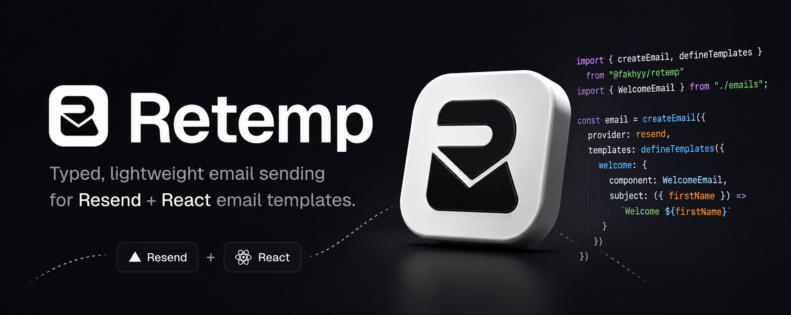

<div align="center">
  

  <p>
    <a href="https://retemp.vercel.app.com">Website</a>
    ·
    <a href="https://github.com/fakhyy/retemp/issues">Issues</a>
  </p>
</div>

# Retemp

Typed, lightweight email sending for **Resend** + **React** email templates.

```ts
const email = createEmail({ provider: resend, templates: { ... } });

await email.send("welcome", {
  to: "user@example.com",
  props: { name: "Alice" },
});
```

Every `send()` call is **fully type-checked** against your template definitions — template name, props, and subject are all inferred.

## Installation

```sh
bun add @fakhyy/retemp resend react react-dom
```

```sh
npm install @fakhyy/retemp resend react react-dom
```

> **Peer dependencies:** `resend ^6.17.1`, `react ^18 || ^19`, `react-dom ^18 || ^19`, `typescript ^5`.

## Quick Start

```ts
import { Resend } from "resend";
import { createEmail, defineTemplates } from "retemp";
import WelcomeEmail from "./emails/welcome";
import ResetPassword from "./emails/reset-password";

const resend = new Resend(process.env.RESEND_API_KEY);

const email = createEmail({
  provider: resend,
  defaults: { from: "Acme <noreply@acme.com>" },
  templates: defineTemplates({
    welcome: {
      component: WelcomeEmail,
      subject: (props) => `Welcome, ${props.name}!`,
    },
    resetPassword: {
      component: ResetPassword,
      subject: "Reset your password",
    },
  }),
});

await email.send("welcome", {
  to: "alice@example.com",
  props: { name: "Alice" },
});
```

## API

### `createEmail(options)`

Creates a typed email client.

```ts
function createEmail<TTemplates extends TemplateMap>(
  options: CreateEmailOptions<TTemplates>,
): { send: SendFunction<TTemplates> };
```

#### Options

| Option      | Type                      | Required | Description                               |
| ----------- | ------------------------- | -------- | ----------------------------------------- |
| `provider`  | `EmailProvider`           | yes      | Resend instance (or compatible provider). |
| `defaults`  | `{ from, replyTo? }`      | no       | Fallback `from` / `replyTo` addresses.    |
| `templates` | `Record<string, TemplateDefinition>` | yes | Map of named templates.              |

#### `email.send(template, options)`

Sends an email using the named template.

| Parameter       | Type                     | Required | Description                               |
| --------------- | ------------------------ | -------- | ----------------------------------------- |
| `template`      | key of `templates`       | yes      | Template name.                            |
| `to`            | `string \| string[]`     | yes      | Recipient(s).                             |
| `props`         | `ComponentProps<T>`      | yes      | Props forwarded to the React component.   |
| `from`          | `string`                 | no       | Overrides `defaults.from`.                |
| `replyTo`       | `string`                 | no       | Overrides `defaults.replyTo`.             |
| `subject`       | `string`                 | no       | Overrides the template's subject.         |

> Throws if no `from` address is resolved (neither in `defaults` nor per-call).

### `defineTemplates(templates)`

Identity helper that returns the same object with full type inference. Use it to keep your template definitions colocated and type-safe.

```ts
const templates = defineTemplates({
  confirmSignup: {
    component: ConfirmSignupEmail,
    subject: "Please confirm your email",
  },
  magicLink: {
    component: MagicLinkEmail,
    subject: (props) => `Your sign-in link for ${props.email}`,
  },
});
```

### `TemplateDefinition<T>`

```ts
type TemplateDefinition<T extends EmailComponent> = {
  component: T;
  subject: string | ((props: ComponentProps<T>) => string);
};
```

- **`component`** — A React component that renders your email.
- **`subject`** — Static string, or a function receiving the component props and returning a dynamic subject line.

## How It Works

1. You define a map of templates — each pairs a React component with a subject line.
2. `createEmail` wires the templates to a Resend provider and returns a `send` function.
3. `send` resolves the `from` address, computes the subject (calling the function if dynamic), renders the component to JSX, and delegates to `resend.emails.send()`.

Resend handles the actual rendering (React → HTML) and delivery.

## Examples

### With a dynamic `from` per call

```ts
await email.send("welcome", {
  to: "user@example.com",
  from: "Support <support@acme.com>",
  props: { name: "Bob" },
});
```

### Multiple recipients

```ts
await email.send("announcement", {
  to: ["alice@example.com", "bob@example.com"],
  props: { message: "New feature released!" },
});
```

### Overriding subject per call

```ts
await email.send("resetPassword", {
  to: "user@example.com",
  subject: "Your custom subject here",
  props: {},
});
```

## Type Safety

`retemp` is built for TypeScript. Template names and their prop types are **inferred from your definitions** — the compiler will catch mismatches:

```ts
// ❌ TypeScript error: property "name" is missing in props
email.send("welcome", { to: "a@b.com", props: {} });

// ❌ TypeScript error: "nonexistent" is not a template name
email.send("nonexistent", { to: "a@b.com", props: {} });
```

## License

MIT
